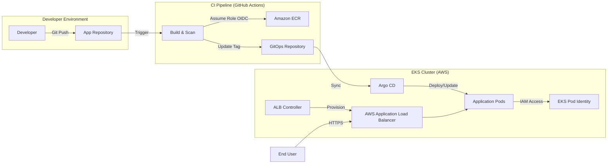

# Technical Showcase: Production-Grade EKS GitOps Platform

This document provides a deep-dive into the architecture, security, and delivery workflow of my **EKS GitOps Platform**. Built with a "Security-First" and "Automation-Always" mindset, this project demonstrates a modern approach to managing cloud-native infrastructure at scale.

---

## 1. Architectural Overview

The platform is designed to provide a highly available, secure, and developer-friendly environment. It leverages a "Pull-based" GitOps model to ensure that the cluster's state is always synchronized with the version-controlled truth in Git.

### High-Level Flow

---

## 2. Infrastructure as Code (Terraform)

The entire AWS footprint is managed via modular Terraform, ensuring zero manual intervention ("ClickOps").

### A. Network Architecture
*   **VPC Isolation:** Implements a custom VPC with Public and Private subnets across multiple AZs.
*   **Security Groups:** Strictly scoped rules. Application nodes live in **Private Subnets**, only reachable via the Load Balancer.
*   **NAT Gateways:** Enables private nodes to access the internet for updates and image pulls without being publicly addressable.

### B. EKS Cluster Configuration (v1.35)
*   **Control Plane:** Configured with `endpoint_private_access = true` to allow internal cluster communication without traversing the public internet.
*   **Managed Node Groups:** Uses Amazon Linux 2023 (or optimized AL2) nodes, managed by AWS for seamless patching and scaling.
*   **Addons:** 
    *   `kube-proxy`, `vpc-cni`, `coredns` for core networking.
    *   `eks-pod-identity-agent` for modern IAM integration.

---

## 3. Security & Identity Deep Dive

Security is the cornerstone of this platform, moving away from static secrets to dynamic, identity-based trust.

### A. Zero-Secret CI with GitHub OIDC
Traditional CI/CD requires storing long-lived `AWS_ACCESS_KEY_ID`. This project eliminates that risk:
*   **Identity Provider:** An OIDC provider is established between AWS and GitHub.
*   **Trust Policy:** The IAM role only allows assumption if the request comes from a specific GitHub organization and repository.
*   **Short-lived Tokens:** GitHub Actions requests a temporary token from AWS STS to push images to ECR, meaning there are **no secrets to leak**.

### B. EKS Pod Identity (Modern IRSA)
For workloads inside the cluster (like the ALB Controller or apps needing S3 access):
*   Instead of managing complex OIDC thumbprints and service account annotations manually, we use the **EKS Pod Identity** addon.
*   **Association:** We map an IAM Role directly to a Kubernetes ServiceAccount via Terraform, providing a cleaner and more scalable identity model.

---

## 4. Continuous Delivery via Argo CD (GitOps)

Argo CD acts as the single source of truth for cluster state.

### A. The "Brain" of the Platform
*   **Declarative State:** All Kubernetes manifests, Helm charts, and environment configs are stored in the `apps/` directory.
*   **Automated Reconciliation:** Argo CD continuously monitors the Git repository. If the cluster state drifts (e.g., a pod is manually deleted or a config map is changed), Argo CD automatically "self-heals" the cluster back to the Git-defined state.
*   **Multi-Tenancy:** The structure is designed to support multiple applications (`app-01`, `app-02`, etc.) independently within their own namespaces.

### B. Helm Values Layering
We use a "Base + Override" pattern for environment management:
*   `values.yaml`: Contains the base application configuration (CPU/Mem limits, service ports).
*   `values-staging.yaml`: Overrides for the staging environment (smaller instances, internal-only endpoints).
*   `values-prod.yaml`: Production-grade overrides (high availability, auto-scaling triggers).

---

## 5. Traffic Management & Ingress

The platform automates the creation of AWS networking resources through Kubernetes-native manifests.

*   **AWS Load Balancer Controller:** Installed via Helm and granted permissions via Pod Identity.
*   **Ingress Automation:** When a developer defines an `Ingress` object in their Helm chart, the controller automatically:
    1.  Provisions an **Application Load Balancer (ALB)**.
    2.  Configures **Target Groups** and Health Checks.
    3.  Registers the EKS nodes/pods as targets.
    4.  Manages SSL/TLS termination via integration with AWS Certificate Manager (ACM).

---

## 6. Developer Experience & Scaling

Onboarding a new application to this platform is a 5-minute process:
1.  **Terraform:** Add a new ECR repository and update the OIDC trust list.
2.  **App Repository:** Add the GitHub Action workflow to build/push images.
3.  **GitOps Repository:** Copy an existing application template under `apps/` and update the `repoURL`.

This standardized approach reduces the cognitive load on developers, allowing them to focus on code while the platform handles the "heavy lifting" of security, scaling, and networking.

---

## 7. Design Rationale: Why This Way?

| Choice | Rationale |
| :--- | :--- |
| **Terraform** | Provides a reproducible audit trail of the entire infrastructure. |
| **Private Subnets** | Essential for production security; prevents direct internet attacks on worker nodes. |
| **GitOps (Pull)** | Simplifies disaster recovery; the Git repo is the backup of the cluster state. |
| **OIDC / Pod Identity** | The most secure way to handle cloud identity; eliminates the "Secret Management" headache. |
| **ALB Controller** | Offloads complex routing and SSL management to a managed AWS service. |

---

*This project represents a commitment to the highest standards of DevOps and Cloud Engineering, ensuring that applications are not just deployed, but are architected for resilience, security, and scale.*
